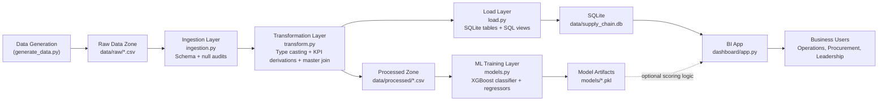
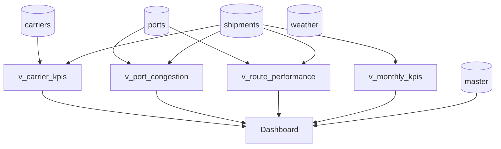
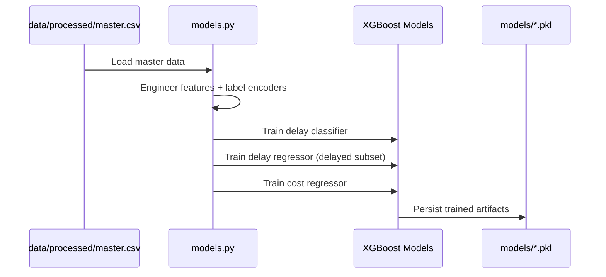
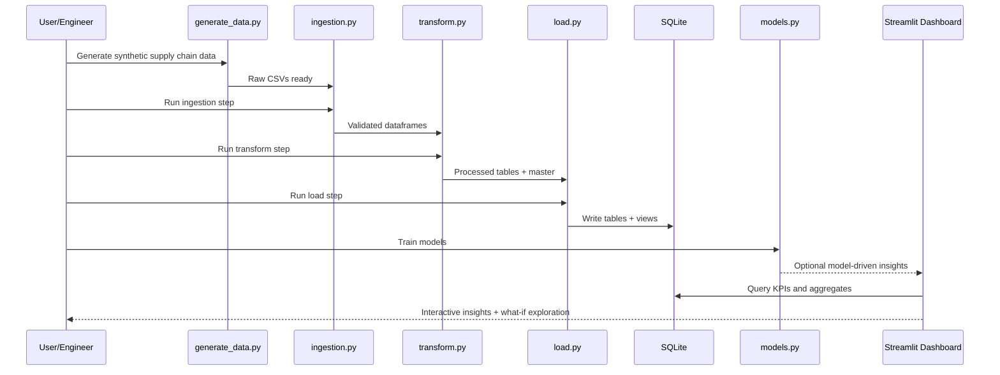

# System Architecture & System Design

This document explains **how the Supply Chain Analytics & Shipment Optimization system works end-to-end** in a way that is easy to follow for both technical and non-technical readers.

---

## 1) Working Principle in One Minute

The project follows a simple operating loop:

1. **Generate/collect logistics data** (shipments, ports, carriers, weather).
2. **Validate and clean data** using a 3-step ETL pipeline.
3. **Store analytics-ready data** in SQLite tables + SQL views.
4. **Train ML models** to predict delay risk and shipment cost.
5. **Serve insights in a dashboard** with KPIs and what-if analysis.

Think of the system like a factory:
- **Raw material** = CSV data
- **Assembly line** = ETL
- **Warehouse** = SQLite database
- **Quality/forecast engine** = ML models
- **Showroom/control room** = Streamlit dashboard

---

## 2) High-Level System Architecture

### Why this architecture is user friendly
- Each stage has **one clear responsibility**.
- Artifacts are persisted between stages (**CSV, DB, PKL**) so steps are inspectable.
- Failures are traceable via stage-specific log files in `logs/`.

---

## 3) Layer-by-Layer System Design

## 3.1 Data Layer (Source + Storage)

### Source datasets
- `carriers.csv`: carrier profile (type, rating, fleet size).
- `ports.csv`: port metadata and congestion index.
- `shipments.csv`: shipment facts (route, dates, cost, status).
- `weather.csv`: weather snapshots per port/date.

### Storage zones
- **Raw zone (`data/raw`)**: immutable-ish landing files.
- **Processed zone (`data/processed`)**: cleaned/enriched tables + `master.csv`.
- **Serving zone (`data/supply_chain.db`)**: SQLite tables + analytical views.
- **Model zone (`models`)**: persisted trained models and encoders.

---

## 3.2 ETL Design

### Step 1: Ingestion (`src/ingestion.py`)
**Goal:** accept raw files and catch obvious data quality issues early.

Core behaviors:
- Verifies file exists.
- Loads CSV with pandas.
- Compares actual columns to expected schema.
- Logs null counts by column.

Output:
- In-memory dataframes passed to transform layer.

### Step 2: Transform (`src/transform.py`)
**Goal:** convert raw operational data into analytics-ready and ML-ready data.

Core behaviors:
- Type normalization (dates, numerics, categorical cleanup).
- KPI derivations:
  - `delay_days`
  - `is_on_time`
  - `transit_days`
  - `departure_month`, `departure_year`
- Drops cancelled shipments for downstream ML consistency.
- Creates `weather_severity` feature.
- Builds wide `master` table by joining shipments + carriers + ports + weather.
- Saves each transformed dataset to `data/processed`.

Output:
- Processed tables + wide `master` table.

### Step 3: Load (`src/load.py`)
**Goal:** prepare data for fast SQL analytics and dashboard consumption.

Core behaviors:
- Loads processed tables into SQLite.
- Rebuilds analytical views:
  - `v_carrier_kpis`
  - `v_port_congestion`
  - `v_route_performance`
  - `v_monthly_kpis`
- Runs window-query sanity checks (ranking and rolling averages).

Output:
- Analytics-serving database (`data/supply_chain.db`).

---

## 3.3 SQL Serving Design

The SQL layer exposes business-friendly entities via views rather than forcing dashboard logic to implement complex joins.

Design benefits:
- Dashboard reads already-aggregated KPIs.
- Business definitions live centrally in SQL.
- Reusability for future APIs or notebooks.

---

## 3.4 ML System Design

### Model inventory
1. **Delay classifier** (`delay_classifier.pkl`)
   - Problem: binary classification (delayed vs on-time).
2. **Delay regressor** (`delay_regressor.pkl`)
   - Problem: regression (delay days) for delayed shipments.
3. **Cost regressor** (`cost_model.pkl`)
   - Problem: estimate shipment cost.

### Feature engineering strategy
From master table:
- Encoded categorical IDs (carrier, ports, regions, carrier type).
- Operational signals (rating, congestion, weather, wind).
- Time signals (month number, day of week).
- Additional features for cost model (transit days, delay days).

### Training/serving flow

### Product-thinking capability
- What-if simulation compares predicted delay risk before/after carrier switch.
- Enables decision support for procurement and routing teams.

---

## 3.5 Dashboard Design (`dashboard/app.py`)

### UI information architecture
- **Global filters** (year, origin region).
- **KPI strip** (shipments, on-time %, delay, cost, transit).
- **Trend analysis** (monthly volume + on-time trend).
- **Risk analysis** (delay distribution, congestion vs delay).
- **Performance analysis** (carrier ranking, route table).
- **Economics view** (cost vs delay scatter).
- **Decision simulator** (carrier switch what-if metrics).

### Why the dashboard is easy to understand
- Starts with high-level KPIs, then drills down.
- Combines explanatory visuals (trend, scatter, histogram, ranking).
- Uses domain language and icons for readability.
- Shows comparative what-if outcomes side-by-side.

---

## 4) End-to-End Execution Flow

---

## 5) Data Contracts & Interfaces

### File interfaces
- `data/raw/*.csv` → contract between data generation and ingestion.
- `data/processed/*.csv` → contract between transform and load/model layers.
- `models/*.pkl` → contract between training and any future real-time inference service.

### Table/view interfaces
- Physical tables: `carriers`, `ports`, `shipments`, `weather`, `master`.
- Semantic views: `v_carrier_kpis`, `v_port_congestion`, `v_route_performance`, `v_monthly_kpis`.

---

## 6) Reliability, Observability, and Maintainability

### Reliability patterns used
- Deterministic data generation with random seeds.
- Null/schema checks during ingestion.
- Explicit type casting in transforms.
- Rebuild views each load to avoid stale definitions.

### Observability
- Log files by stage:
  - `logs/generate_data.log`
  - `logs/ingestion.log`
  - `logs/transform.log`
  - `logs/load.log`
  - `logs/models.log`

### Maintainability
- Clear module boundaries (`src/*.py` each has a focused role).
- Shared data contracts (CSV + SQL view names).
- Re-runnable pipeline and reproducible outputs.

---

## 7) Scalability Roadmap (if this grows)

If moving from a portfolio project to production scale:
- Replace SQLite with Postgres/Snowflake/BigQuery.
- Orchestrate ETL with Airflow/Prefect.
- Add data tests (Great Expectations/dbt tests).
- Package model serving behind a FastAPI service.
- Add feature store and model monitoring.
- Implement role-based access in dashboard/API.

---

## 8) Quick Start for Non-Technical Stakeholders

To understand system behavior without reading code:
1. Open dashboard and observe KPI strip.
2. Filter by year/region.
3. Check monthly trend + congestion scatter to find bottlenecks.
4. Compare carriers in ranking chart.
5. Run what-if switch for procurement decision.

This mirrors the project’s core decision loop:
**Observe → Diagnose → Simulate → Decide.**
